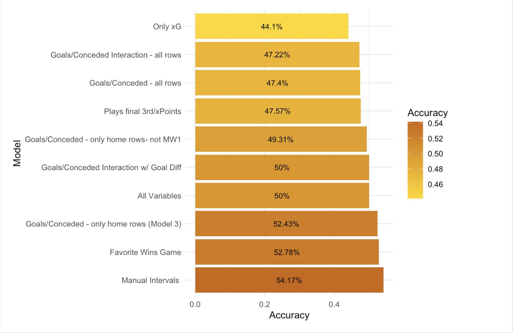

# Premier League Match Outcome Prediction (2019/20 Season)

## 🎯 Goal

To develop a predictive model that forecasts **home team match outcomes (win/draw/loss)** and outperforms the betting markets' most likely outcome. The model was designed to use **only data available before a match took place**, making it deployable in real time.

---

## 🧠 Hypothesis

A machine learning model that uses team-level statistical features (such as xG and goals for/against) can **predict the outcome of Premier League matches more accurately than the betting odds**.

---

## 📊 Data

- Source: "Premier League 2019/20" on Kaggle from Vastaav Anand
- Season: **2019/20 Premier League**, up to the COVID-19 suspension
- Target: Match outcome from the **home team's perspective**
- Key features used:
  - Expected Goals (xG) for and against
  - Actual Goals for and against
  - Additional team-level stats (e.g., shots, possession, etc.)
  - All variables were aggregated **cumulatively per team** up to each matchweek

---

## 🧪 Methods

1. **Data Cleaning & Feature Engineering**  
   - Computed **cumulative mean values** for each team’s performance metrics before every match
   - Ensured predictors only used **information available prior to each matchday**

2. **Modeling Approach**  
   - Initially used an **ordinal regression model** to assign win/draw/loss probabilities to each home team  
   - Discovered that the base model never predicted draws, negatively impacting accuracy  
   - To resolve this, I implemented a **custom probability thresholding formula** to manually define the outcome boundaries based on predicted probabilities

   

3. **Evaluation Metric**  
   - Compared model accuracy against the **most likely outcome implied by betting odds**
   - Success was defined as correctly predicting **a greater number of match outcomes** than the implied favorite from betting markets

---

## ✅ Outcome

- After refining the model's probability mapping, it **outperformed the betting odds** by approximately **1.5%** in overall prediction accuracy for home team outcomes  
- This validated that statistical features like xG and cumulative trends can provide meaningful predictive power when properly modeled and time-aligned

   

---

## 📌 Future Work

- Explore ensemble methods (e.g., XGBoost, Random Forests) for additional predictive strength  
- Incorporate away team features to test model symmetry and robustness  
- Experiment with other forms of ordinal classification and probability calibration  

---

## 🛠️ Tools & Languages

- **Language**: R  
- **Modeling**: `polr` package for ordinal regression  
- **Data Wrangling**: `dplyr`, `tidyr`  
- **Visualization**: `ggplot2`

---

## 📸 Visuals

See the "EPL Model Visual Deck" Tab  
